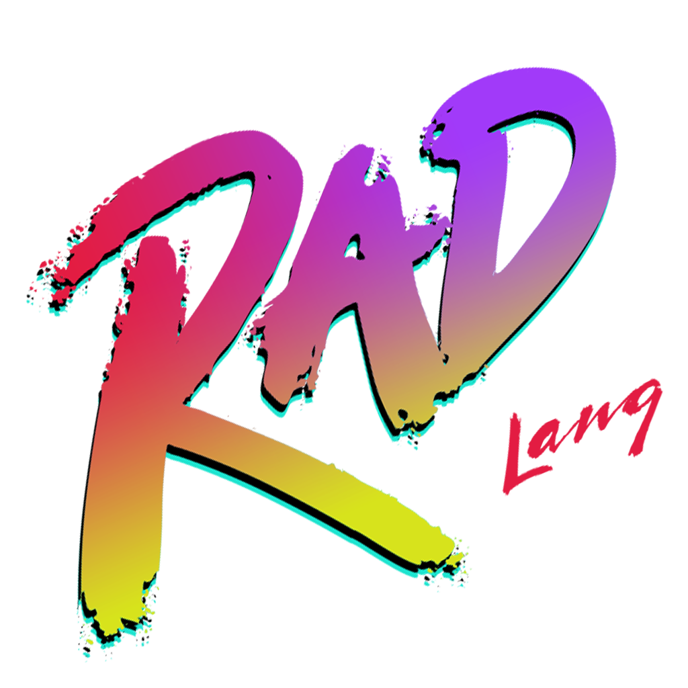

<p align="center">
  
</p>

# The Rad Programming Language

## Objectives of the Project
The primary objectives of the Rad programming language is to provide a high-level
structurally typed programming language that is easy to learn and use while still
offering the power of a low-level language. The desire is to combine the best
parts of languages like TypeScript, Python, C#, C, and Rust into a single
language that is as suitable for high-level application development as it is for
resource constrained embedded systems.

## Building the Compiler

### Prerequisites
- [Node.js](https://nodejs.org/en/) (A recent version, such as 16 or greater)
- [Yarn 3](https://yarnpkg.com/getting-started/install)
- [.NET 8.0 SDK](https://dotnet.microsoft.com/download/dotnet/8.0)

### Initializing the Project
To initialize the project, run the following commands in the root directory of the
project:
```bash
$ yarn
$ yarn init-repo
```
`yarn` will install all of the dependencies for the project, and `yarn init-repo`
will run the necessary scripts to install any dependencies needed for building the
compiler and its tools.